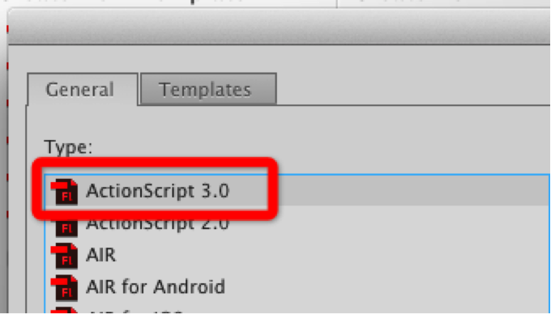
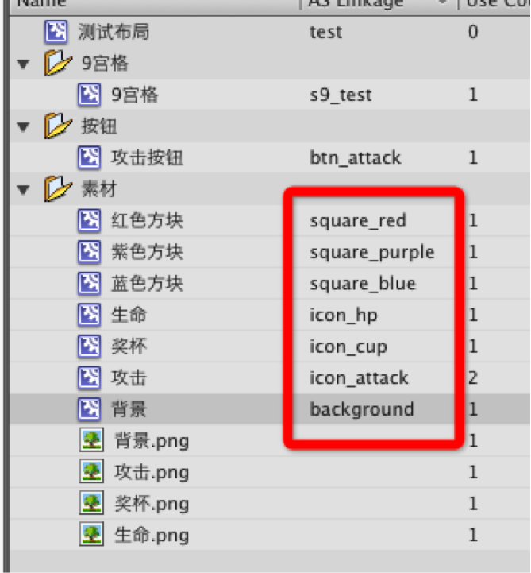
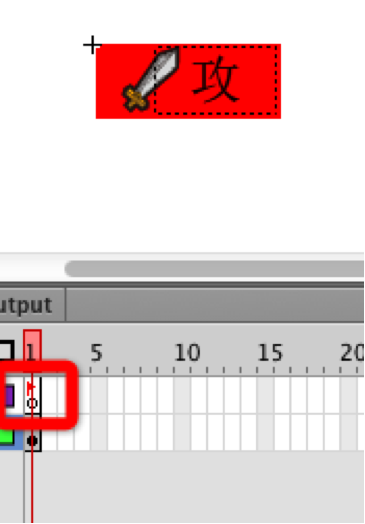
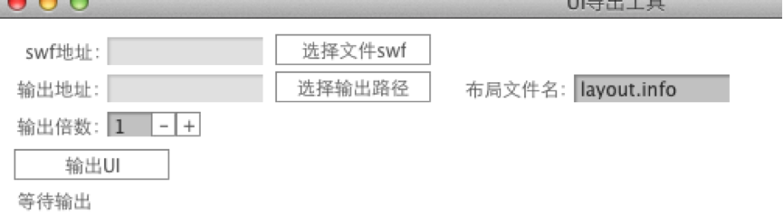
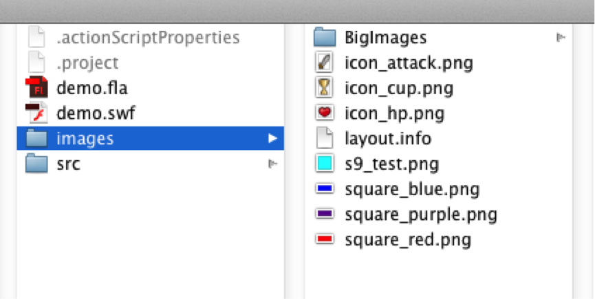

Starling-UITool
===============

StarlingUI导出工具。 需要FlashPro作为编辑器
----------------------------------------------------------------

以前搞页游的时候 用flash的反射机制做UI很轻松。
现在使用starling资源需要是位图。所以反射机制用不了了。
此工具就是为了解决这个问题。虽然还不完善但是已经实现了一些功能。
需要使用该账号下的[starlingFeathers](https://github.com/zmLiu/StarlingFeathers)包.

工具目前支持
------------------
image,sprite,button,textfield,batch,9宫格


第一步:创建fla(需要是actionscript3版本)
-------------------------------------------------------




因为工具不是基于jsfl的。所以需要导出的项目需要设置Class名。



用于布局的元素 需要是独立的有点类似骨骼动画。这些独立的元素在导出之后会是一张张单独的图片。这些等于是素材		
而由素材组成界面布局 需要在帧上加一个标签。表示它为一个布局信息。
比如一个按钮如果是由多个原件组成。那么需要标示一下。好处是避免图片重复


			
			button，sprite，btach需要加标签(由其他元素组成的都需要加标签。希望导出的是一张图片的原件不需要加标签)
			image，9宫格不需要加标签
			textfield 直接使用文本即可。不过需要设置文本必须是Dynamic Text.(支持文字颜色。大小，字体)
			为元件添加一个名字。在程序里面就可以使用getChildByName获取元件了。(跟传统flash开发一样)
			支持子布局.
			(导出类名 使用 btn_ 开头被识别是按钮。batch_ 开头被识别的批处理对象,s9_开头被识别为9宫格)


fla编辑完成。导出swf


第二步:使用工具导出数据和图片
-------------------------------------------------------




			swf选择刚刚导出的swf文件.
			输出地址选择选择一个目录就可以了.
			布局文件名为数据文件的名字.
			输出倍数嘛 肯定就是图片放大的倍数了

以上参数填写好之后 点击输出UI

再看看刚刚选择的输出地址，应该如下图




			layout.info为数据文件。
			BigImages下为尺寸比较大的图片.
			至于纹理的打包 可以根据自己的需求打包成纹理集。这里输出的是一张张图片。
			

			如果要用预览工具查看布局的话。需要导出的图片倍数为两倍。因为预览工具starling默认是两倍


最后是代码部分
---------------------
```actionscript
public class MainClass extends STLMainClass
	{
		private var asset:AssetManager;
		
		public function MainClass()
		{
			asset = new AssetManager(STLConstant.scale,STLConstant.useMipMaps);
			
			var file:File = File.applicationDirectory;
			asset.enqueue(file.resolvePath("asset/2x"));
			asset.loadQueue(loading);
		}
		
		private function loading(ratio:Number):void{
			if(ratio == 1){
				var layoutUtil:LayoutUitl = new LayoutUitl(asset.getOther("layout"),asset);
				layoutUtil.buildLayout("test",this);
			}
		}
	}
```

具体请看demo吧